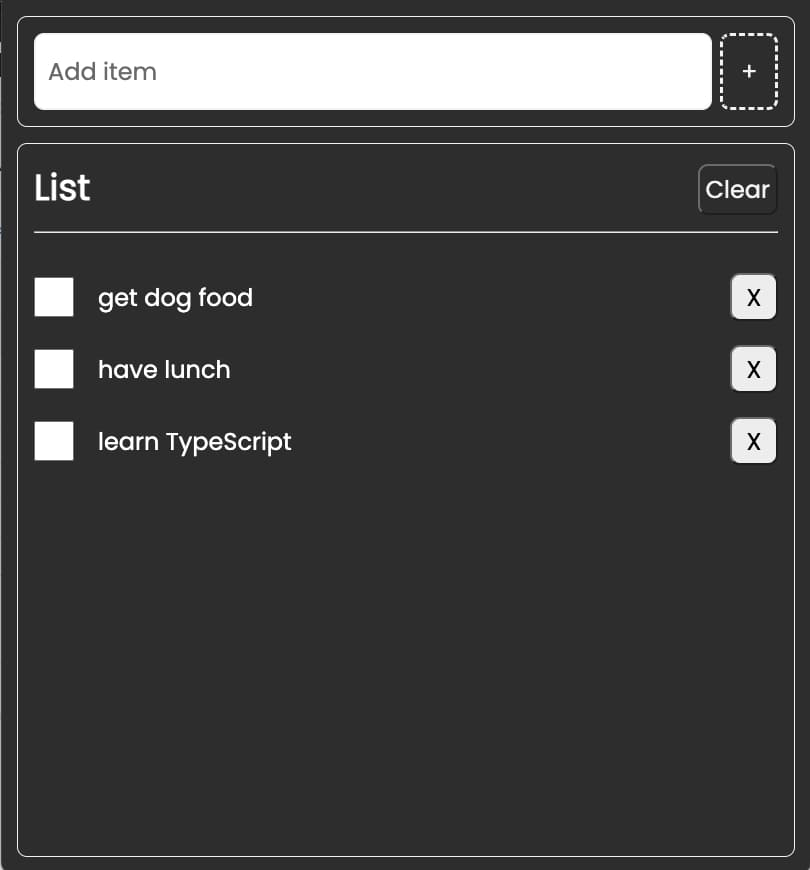

# Dave Gray's TypeScript Project from Scratch

## Main goals

- Create a simple to-do list using TypeScript and local storage data persistence, built using Vite.

## Learning Notes
This was such a different way of rendering out a todo list compared to how I've done it before with functional components in React (or indeed without React and just with vanilla JS). So there was actually two new things to me with this tutorial: Vite and TypeScript. 

Thankfully, in parallel to this tutorial I've been doing the Javascript30 set of exercises to improve my vanilla Javascript, so when manipulating the DOM by adding event listeners and creating elements I felt quite comfortable.

There are a few things I didn't follow along with, most around the static instance of the Full List, so now I know where to focus next.